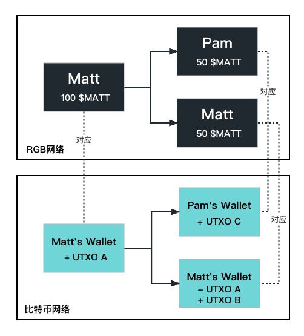

# RGB

## 什么是RGB？

RGB是一种**能在比特币网络上创建和管理数字资产的协议**，经常同闪电网络等比特币二层的概念一起出现。

RGB 协议的起源可以追溯到 2018 年，当时 Giacomo Zucco、Peter Todd 和 Alekos Filini 等比特币社区成员开始探讨一种在比特币网络上创建和管理资产的新方法。他们的目标是设计**一个既能利用比特币的安全性和去中心化特性，又能支持更复杂的功能（如资产发行和智能合约）的协议。**

为了实现这一目标，他们开始研究如何将资产和状态信息与比特币的UTXO模型相结合，并提出了一种名为 RGB 的新协议。其核心思想是将**资产发行、所有权和状态更新通过客户端验证与比特币的UTXO模型结合起来**，而不是像现在的BRC-20这样依赖比特币网络的完整节点。

> 之所以使用RGB这一颜色概念作为名称，是因为RGB协议一开始研究的方向是“染色币”。虽然目前RGB协议做的事情与染色币关系不大，但名字却保留了下来。

由于以太坊的崛起和比特币更多的被认为是价值储藏和币圈风向标，在比特币上发行资产创建合约的实践一直处于不温不火的状态。直到最近BRC-20的火热，才又让比特币资产发行的老调重提。而比起前者直接在**链上的铭文体系**，RGB更多的采用了与闪电网络有些类似的**链下处理逻辑**。

## 实现原理

RGB协议的实现其实不难理解，核心在于比特币本身的记账方式——[UTXO](UTXO.md)。

RGB实际上就是将**链下资产的发行**与**链上的UTXO变更**做一个绑定：既然UTXO可以对比特币在某个时间点的交易事件做出确认，那么我们就可以让这种交易事件的变化来对应某个其他事情状态的改变；

例如我在某一个地方发行了一个资产，对应到比特币网络上的UTXO1。如果我将这个资产转移给了他人，那么可以将这个”转移“行为对应到比特币网络上的UTXO2...

因为UTXO本身是固定且被共识的，只要我能证明这种绑定是可靠的，那么比特币主网上UTXO的变更，所对应其他资产状态的变更也应该被共识。更进一步而言，RGB协议的做法是在利用比特币主网UTXO的安全性，为其链下的资产发行或合约逻辑的安全性背书。

如果觉得难以理解，可以看看以下例子：

1. Matt在RGB网络上发行了100个$MATT币给自己；
2. 在比特币网络上，Matt发币这件事对应着他目前持有比特币的UTXO A；
3. Matt转了 50 个$MATT币给Pam；
4. 在比特币网络上，Matt转币这件事对应着一个新的UTXO B，同时第 2 步中的UTXO A 被销毁；
5. 在比特币网络上，Pam 得币这件事对应着一个新的UTXO C，表示着Pam当前目前持有比特币UTXO；
6. 同理，当 Pam 转币时，他原有的UTXO C也会被销毁，进而形成一个新的UTXO D...

如果这个$MATT币一直在不同人手里转下去，最终在比特币主网上会有与这些转账所对应的UTXO来进行标识，并且每次当下发生的转账，都会使得原来的UTXO被销毁，而产生新的UTXO。

通过这个过程，我们可以看到RGB协议中资产的创建、转移和验证是如何与比特币的UTXO关联在一起的。**这种关联使得RGB资产能够在比特币网络上进行安全、去中心化且隐私保护的转移。**

## 其他技术支持

实际上要保证RGB在链下发行的资产确实能和链上的 UTXO 对上，还需要配合一些其他的技术来实现。

* **Client-side validation（客户端验证）：**在 RGB 协议中，交易验证和数据存储在客户端（如钱包软件）完成，而不是在区块链上。这使得交易数据不在链上公开，从而提高了隐私性。客户端验证还可以降低链上数据存储需求，提高网络的可扩展性这也是 RGB 目前和 BRC20 的很大区别，由于交易数据在客户端而非链上，理论上可以大大降低目前的网络拥堵和高手续费的情况。

* **Single-Use-Seals（一次性印章）：**一种确保资产所有权不被篡改的技术。一次性印章是一个加密签名，用于锁定资产的状态。当资产被转移时，旧的印章被破坏，新的印章被创建。这样，任何试图篡改资产所有权的行为都会被发现，因为印章的状态不匹配。这也对应着上一节所描述的 UTXO 的销毁和生成。旧印章代表着旧的 UTXO，新印章指向新的 UTXO。

* **Commitments（承诺）：**为了将资产与比特币网络关联起来，RGB 协议使用了一种称为承诺的技术。承诺是一种加密证明，证明某个资产与一个特定的比特币交易关联。承诺嵌入到比特币交易的输出（UTXO）中，这使得资产可以在比特币网络上进行转移。

* **Anchoring（锚定）：**为了将客户端验证和比特币网络连接起来，RGB 协议使用了锚定技术。锚定是将一次性印章和承诺结合在一起的过程。在资产被转移时，新的一次性印章、承诺和交易数据被锚定到比特币网络上，确保整个系统的安全性和一致性。

在此给出一个更加符合实际情况的RGB协议**工作流程**：

1. 资产发行者在客户端创建一个新的资产，并生成一个一次性印章和承诺。
2. 资产发行者将新资产锚定到比特币网络上，将承诺嵌入到比特币交易的输出（UTXO）中。
3. 资产接收者通过查看承诺和验证一次性印章来验证资产的有效性。
4. 资产转移时，旧的一次性印章被破坏，新的一次性印章、承诺和交易数据被锚定到比特币网络上。

同时，RGB也能很好的同**闪电网络**结合。在其官方文档中，**RGB描述自己是一个L2或者L3**；当闪电网络存在时，RGB可以当做L3，在链下快速交换比特币和 RGB 代币，从而实现更高效的交易和资产管理。

***

参考文章：https://www.panewslab.com/zh/articledetails/1bnuu827.html
