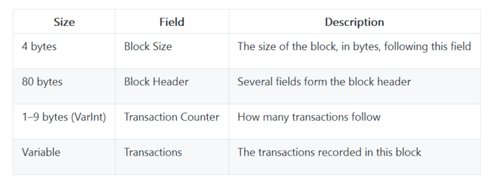

# 区块链浏览器

## 介绍

对于区块链，所有的数据都是开放的，但不是每个人都能写代码去查看链上的交易，大多数人会通过一个公开的窗口来查看数据。这个公开的窗口就是**区块链浏览器**。

区块链所有信息往往会包括：ChainInfo、BlockInfo、 TransactionInfo 、ContractInfo(TokenInfo、Scriptinfo) 、AddressInfo 等等，这也基本构成了区块链浏览器产品的产品架构。

### ChainInfo

ChainInfo 一般是该区块链的总体性概述，一般放置于浏览器页面首页，其功能在于能够快速了解该区块链的总体运行情况，某种意义上来说，区块链浏览器的总体信息也能够基本地展现该**区块链的基本情况**。

基本的指标包括：

* **安全指标：**算力、计算难度、挖矿收益、算力集中度等
* **繁荣指标**：交易数量、交易池、活跃账户、合约与token等
* **价格指标**：市场价格、市值等
* **特色指标：**譬如比特币体系下的 Script，EOS 体系下的 Ram/超级节点，Cosmos 体系下的 staking ，Nervos 体系下的 Cell 信息等

### BlockInfo

BlockInfo 是指区块链的区块维度信息，一般会包括区块列表页、区块详情页。在这里就涉及到区块链的数据结构的问题。我们可以看下比特币的 Block 数据结构：比特币的数据结构往往由以下的一些数据组成，产品经理要做的往往是确定信息的优先级并进行有序排列即可。通过这种方式，我们可以基本地勾画出 BlockInfo 的基本信息。

但是这显然是不够的。BlockInfo 还有大量信息可以挖掘，这些信息充满了该区块链的特点，我们以比特币举例：

- **Confirmation 数**：Confimation 数是指区块链被确认的次数，也可以认为是**当下区块与最高区块的区块差**。由于在比特币网络中难以避免的分叉情况，我们一般认为6个区块之后，此区块是不可窜改的。因此 Confimation 数可以提供以下的价值：告知用户6个区块后，该交易才是不可窜改的。
- **交易费**：我们都知道比特币的交易费是 Input - Output，每笔交易费本身是需要浏览器进行计算的。在这里，更值得展示的交易费是：交易中每 Byte 的交易费。当然，Coinbase 费用与总交易费用也是需要展示的，这是对于矿工的激励。

### TransactionInfo

TransactionInfo 是指交易信息，一般有最新交易列表页，某一区块交易列表页，交易详情页等。在浏览器的开发中，我们不能够将交易数据直接展示给用户，我们是需要对某些数据进行加工的。

### ContractInfo

ContractInfo 属于另一种交易信息，ContractInfo 主要代表了智能合约的各类信息展示。伴随着以太坊等图灵完备的区块链平台出现，智能合约的信息展示越来越重要。

ContractInfo 本质是一笔特殊的交易信息。同时， Token 合约是有固定的格式的。因此，我们通过将交易信息与 token 合约信息作为原始数据源，就可以根据这些原始数据源对数据进行优先级排序与展示了。在这里，值得注意的一点是：并非所有的智能合约都具有通用性，也因此，大多数情况下我们无需对非通用的或者影响力较小的智能合约进行专门的合约设计。我们只需要在交易的 Data 字段中设置解码工具即可。

### AddressInfo

AddressInfo 主要聚焦于给使用者一个”账户”概念，在比特币，所谓的账户是某一地址下所有 UTXO 的集合；在以太坊，则天然存在 Account 概念。不过对于用户来说，总归会存在一个地址的概念。AddressInfo 聚焦于该地址的所有信息展示，主要包含其基本信息与交易信息，较为明确。

### 比特币浏览器

https://btc.com/stats

### 以太坊浏览器

https://etherscan.io/charts

***

参考文章：
https://www.zhihu.com/question/293505338/answer/699048450
