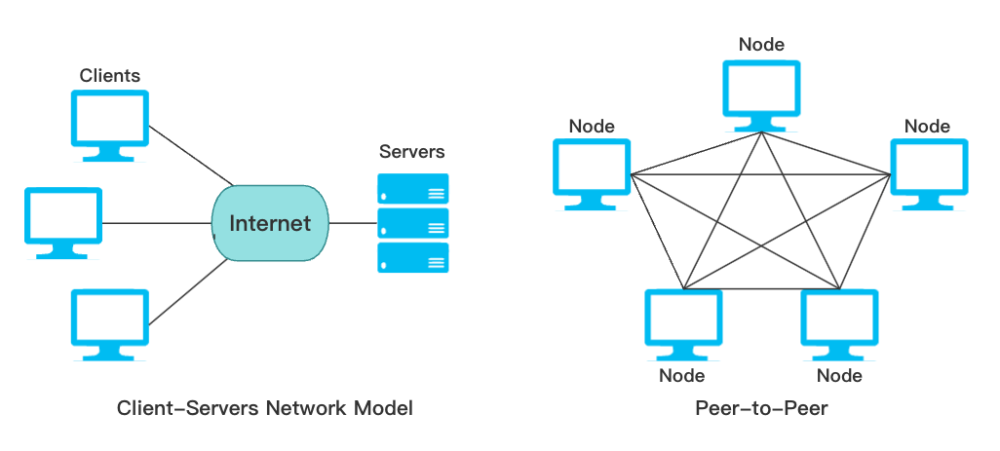

# P2P网络

## 什么是P2P网络？

对等式网络（peer-to-peer，简称P2P），又叫作点对点技术，是去中心化、依靠用户群（peers）交换信息的互联网体系，它的作用在于，减低以往网路传输中的节点，以降低资料遗失的风险。与有中心服务器的中央网络系统不同，对等网络的每个用户端既是一个节点，也有服务器的功能，任何一个节点无法直接找到其他节点，必须依靠其户群进行信息交流。

## P2P网络的优势

* **去中心化**：网络中的资源和服务分散在所有结点上，信息的传输和服务的实现都直接在结点之间进行，可以无需中间环节和服务器的介入，避免了可能的瓶颈。
* **安全**：当代的互联网已经非常中心化了，大部分的通信都会通过中央服务器来完成。中央服务器上汇集了所有人的信息，成了对攻击者最有诱惑力的攻击目标。一旦服务器被拿下，那么所有用户的信息安全就都荡然无存。而 P2P 就是一套更安全的替代方案，尤其是实现了点对点加密 之后的 P2P 网络。
* **性能**：目前大多数的互联网中，两个用户之间要实现通讯，需要通过中间的服务器来实现连接。当用户量增多时，可能会造成服务器拥堵甚至崩溃的现象。而P2P网络则不存在这样的中央服务器，可以实现用户间的直接互联，实现点对点传输，从而提高了网络的性能。
* **更加隐私**：P2P 架构下，由于没有中央服务器，所以也就没有发挥中心作用的公司。于是 P2P 架构下，我们构建的是无信任，trust-less 系统。用户掌握了自己的隐私，不需要去信任公司不会泄露他们的数据，而只是需要相信通信协议的数学原理即可。

## P2P网络的应用

如今P2P被用于很多领域如：文件共享、计算能力存储共享、即时通讯等等，而其中比较成功的是区块链类的应用，如 [Bitcoin](../bitcoin/BTC.md)（比特币）

***

参考文章：

https://zhuanlan.zhihu.com/p/115439589
