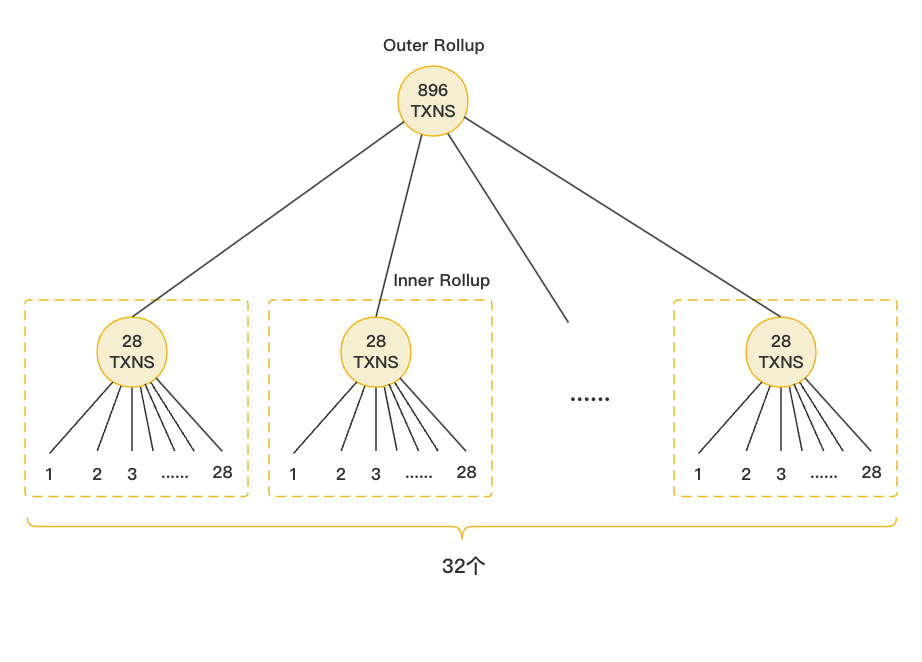

Aztec是L2中的一个项目，其实现了隐私交易。其体系为：基于底层的PLONK证明系统，实现账目间的匿名交易，并通过网关合约的嫁接来实现和DeFi项目的隐私交互。

在Aztec的数据结构中所有票据的状态存储在两个Merkle Trees中，其中一个是**note tree**（票据树），存储着所有生成过的票据，另一个则是**nullifier tree**（废弃树），存储所有被销毁过的票据。所谓“拥有”一张票据，即在 note tree 中存在对应票据、而在nullifier tree中不存在对应票据。

当用户要进行一笔交易时，需销毁并生成相应的票据，再将票据所有权转移。而对于这笔私密交易，用户需要在本地生成一个“隐私证明”。随后，28笔私密交易将会聚合为内部Rollup证明，之后又有32个这样的内部Rollup证明聚合为外部Rollup证明。外部Rollup证明将会最终被提交到L1上，供节点验证。也就是说，一个最终提交的Rollup证明中可以包含28*32=896笔交易。

Aztec的优势在于：其实现了安全级别较高、且能够和DeFi项目交互的隐私功能。

然而特殊的隐私功能也很大程度上限制了项目：一方面Aztec依靠集成网关合约来实现对 DeFi项目的操作，在降低部署难度的同时也降低了灵活性，短期来看更适合操作单一、资本密集的项目；另一方面，为了实现隐私，要求给每一笔交易都生成隐私证明，虽然项目通过双层Rollup方式分摊了存储空间，但 Aztec 的手续费在所有 L2 中仍然是最高的，对用户而言门槛也较高，更适合大户。